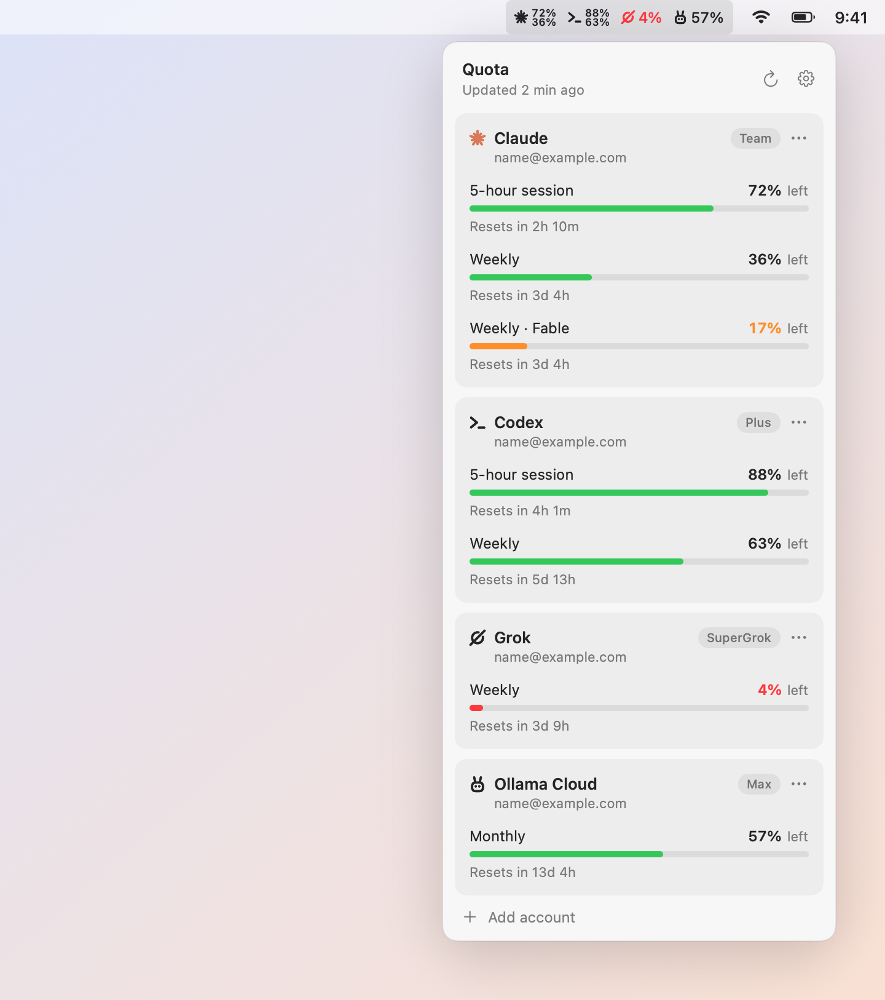

# Quota

A tiny native macOS menu bar app that shows how much of your **Claude**, **Codex**, **Grok** and **Ollama Cloud** subscription limits you have left, at a glance.

On Linux, use [Quotax](https://github.com/turinglabsorg/quotax), the GNOME Shell version.

<picture>
  <source media="(prefers-color-scheme: dark)" srcset="docs/screenshots/readme-dark.png">
  
</picture>

Inspired by the usage readout in [Orca](https://github.com/stablyai/orca), packaged as a standalone menu bar app.

## Features

- **Menu bar**: one percentage per linked account, showing the tightest account-wide window. Orange under 20%, red under 5%.
- **Popover**: every window (5-hour session, weekly, model-scoped weekly, monthly) with a bar and a reset countdown.
- **You choose the accounts**: reuse the login of a CLI already on your Mac, or sign in to a different account in the browser. New sign-ins are kept separate from your CLI sessions, so you can monitor several accounts per service.
- **Settings**: show remaining or used percentage, add accounts, launch at login.
- **Native and light**: AppKit + SwiftUI, no Electron, no background services, no telemetry.
- **Localized**: English and Italian.

## Supported services

| Service | Plans | Windows shown |
| --- | --- | --- |
| Claude (Claude Code login) | Pro, Max, Team | 5-hour session, weekly, weekly per model |
| Codex (ChatGPT login) | Free, Plus, Pro, Business | as reported by Codex (5-hour, weekly or 30-day) |
| Grok (Grok CLI login) | SuperGrok and Grok plans with weekly or monthly credits | weekly credits or monthly budget |
| Ollama Cloud (ollama.com account) | Free, Pro, Max, Team | monthly usage pool (legacy Pro/Max: 5-hour session and weekly), no reset time |

## Requirements

- macOS 14 or later
- Swift 6 toolchain (Xcode or the Command Line Tools)
- The CLI of each service you want to link: [`claude`](https://github.com/anthropics/claude-code), [`codex`](https://github.com/openai/codex), `grok`. Ollama Cloud needs no CLI: sign in from the popover, or link the login of the [Ollama app](https://ollama.com/download) (`ollama signin`)

## Install

```bash
git clone https://github.com/turinglabsorg/quota.git
cd quota
scripts/build-app.sh --install
open ~/Applications/Quota.app
```

The app is built and ad-hoc signed on your machine, so Gatekeeper does not block it.

## Linking accounts

Open the popover and choose **Add account**. For each service you can:

- **Link** the login already used by the CLI on this Mac. Quota reads that session and never changes it.
- **Sign in to another account…**: Quota runs the official CLI sign-in in an isolated folder and opens the service's own page in your browser. Quota never sees your password.

To stop monitoring an account, open its `…` menu and choose **Unlink account**. For accounts Quota signed in, this also signs out and deletes the isolated session.

## How it works

| Service | Data source |
| --- | --- |
| Claude | `GET api.anthropic.com/api/oauth/usage` with the Claude Code OAuth token |
| Codex | JSON-RPC `account/rateLimits/read` on `codex app-server`, so Codex refreshes its own token |
| Grok | `GET cli-chat-proxy.grok.com/v1/billing` with the Grok CLI token |
| Ollama Cloud | `GET ollama.com/api/usage` and `POST ollama.com/api/me`, signed with an Ed25519 device key like the Ollama CLI does |

Quota refreshes every 5 minutes, after wake, when a window resets and when you open the popover. It only talks to the services above.

Tokens are renewed by the official CLIs, never by Quota. If the Claude Code token has expired because you have not used `claude` in a while, Quota starts it in the background for a few seconds so it can renew its own session, then retries.

These endpoints are the ones the official CLIs and ollama.com/settings use. They are not public APIs and may change without notice. Ollama reports only how much of each window is used, never when it resets, so Ollama Cloud windows show no countdown.

### Where data lives

- Linked accounts (no secrets): the `com.turinglabs.quota.shared` user defaults suite.
- Accounts signed in through Quota: `~/Library/Application Support/Quota/Accounts/<service>/<id>`, plus a scoped Keychain item for Claude.
- Shared CLI logins stay where each CLI keeps them.
- Ollama Cloud accounts signed in through Quota are a device key in their isolated folder, linked to your account on ollama.com; unlinking the account also removes the key from ollama.com.

## Development

```bash
scripts/test.sh                                   # unit tests (Swift Testing)
scripts/build-app.sh                              # build build/Quota.app
build/Quota.app/Contents/MacOS/Quota --print      # print usage for linked accounts
.build/debug/Quota --render-preview /tmp/quota    # render UI previews with sample data
```

Set `QUOTA_DEBUG=1` to log failed HTTP responses (status and body, never tokens) to stderr, or `QUOTA_DEBUG=verbose` to log every usage response.

The design system lives in [`DESIGN.md`](DESIGN.md); contributor notes for humans and coding agents are in [`AGENTS.md`](AGENTS.md).

### Adding a language

Copy `Resources/it.lproj/Localizable.strings` to `Resources/<language>.lproj/`, translate the values, and add the language code to `CFBundleLocalizations` in `Resources/Info.plist`.

## Acknowledgements

The endpoints, headers and account-isolation approach follow [Orca](https://github.com/stablyai/orca) by Stably AI (MIT License).

## Disclaimer

Quota is an independent project and is not affiliated with, endorsed by or sponsored by Anthropic, OpenAI, xAI or Ollama. Claude, Codex, Grok and Ollama are trademarks of their respective owners.

## License

[MIT](LICENSE)
